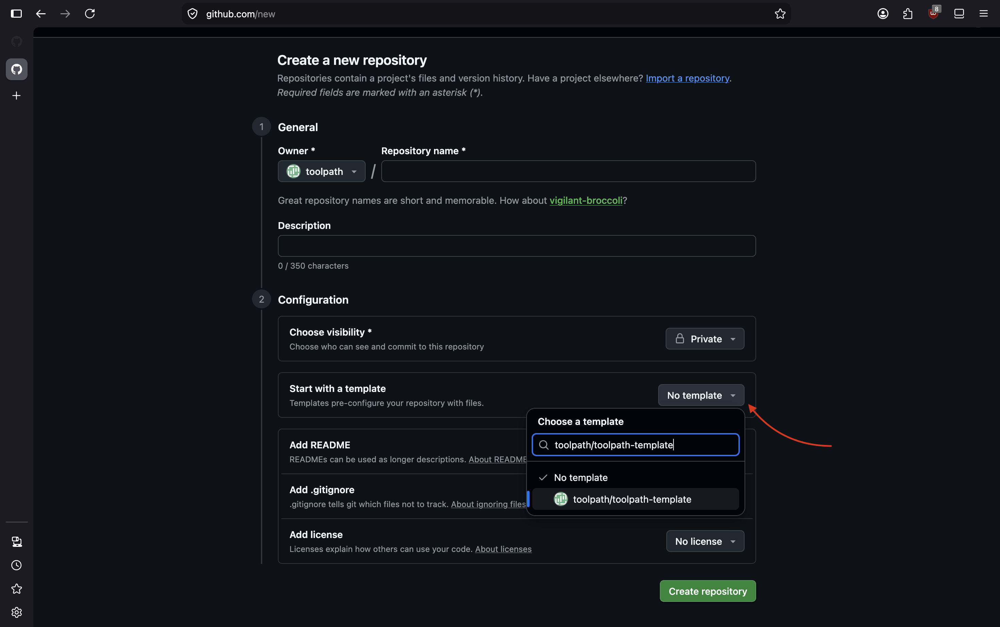

# Toolpath DFM Template

A design-for-manufacturability application for uploading a CAD part, starting
Toolpath Engine analysis, and inspecting the resulting features and mesh. Use this repository as a
GitHub template to build your own Toolpath API powered product.

See https://developers.toolpath.com/ for documentation on using the Toolpath API.

## Start here

1. Create a new github repository and select **Start with a template** to use this repository as a base to build your own application.
   
2. Install Node.js 24.18 or newer. Node.js is the program that runs this
   application on your computer. Download and install it from
   [nodejs.org](https://nodejs.org/). Then open **Terminal** on macOS or Linux,
   or **PowerShell** on Windows, and run:

   ```sh
   node --version
   corepack enable
   ```

   The first command should show `v24.18.0` or a higher version.
   Corepack comes with Node.js and turns on the exact version of `pnpm` that
   this project needs to install and run its files.

3. Create a local environment file and set the required values:

```sh
cp apps/dfm/.env.example apps/dfm/.env
openssl rand -base64 32
pnpm install --frozen-lockfile
pnpm dev
```

Set the generated value as `APP_SESSION_SECRET` and set `TOOLPATH_API_BASE_URL` in
`apps/dfm/.env`.

## Development

```sh
pnpm check
pnpm test:e2e
docker build --file apps/dfm/Dockerfile --target prod --tag part-viewer:local .
```

The application uses released `@toolpath/api`, `@toolpath/ui`, and `@toolpath/viewer` NPM packages.

See [the application README](apps/dfm/README.md) for architecture and request-flow
details.

## License

This project is licensed under the [MIT License](LICENSE).
